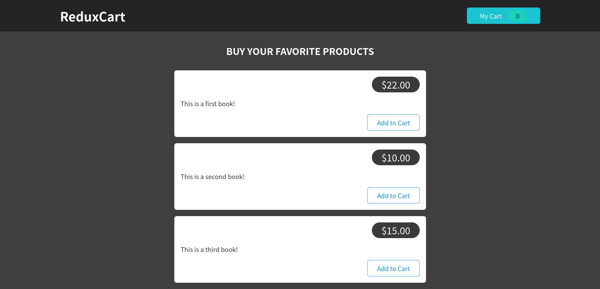
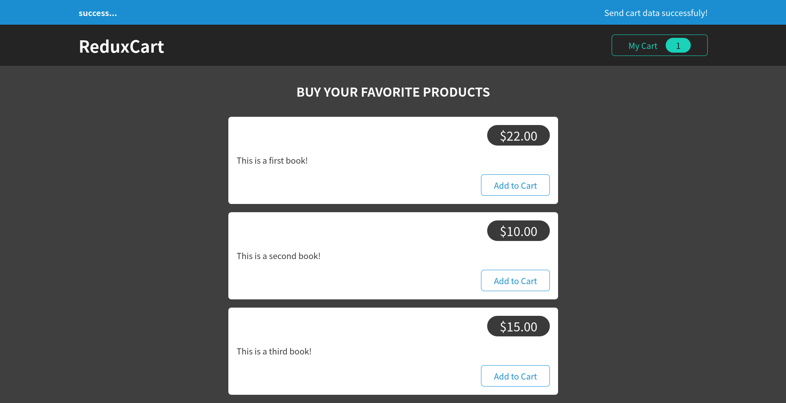
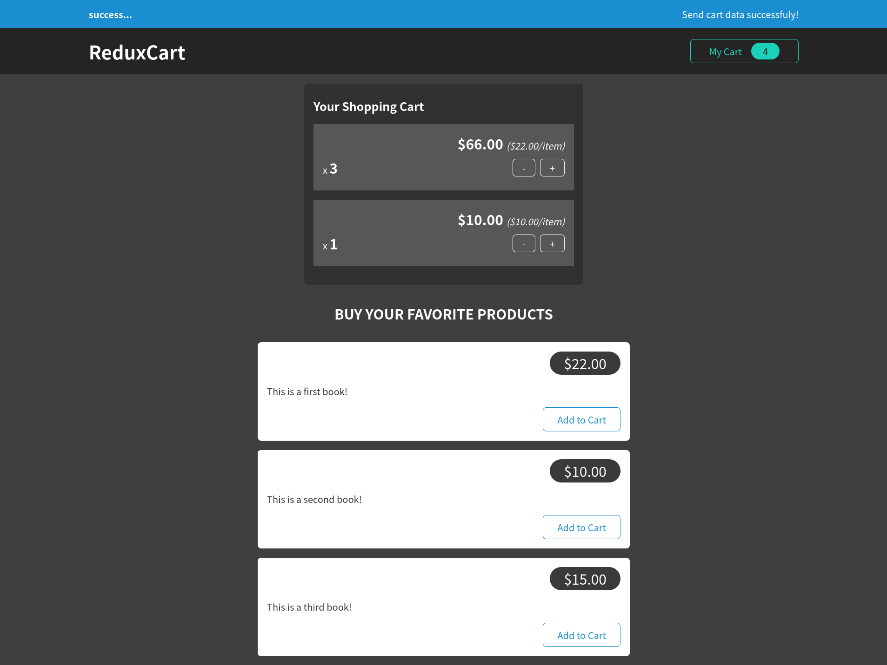

# React Redux Cart Application

In this application, I have made a cart logic for adding and removing items from the cart. 
I have usedthe following concepts.

- using redux and redux-toolkit for state management 
- use single data store for redux
- using multiple reducers for state management
- handling http states and feedback with redux
- using action creator "THUNK"

### Screen shots

default UI

UI after login.

UI with changing counter

UI with toggle counter

